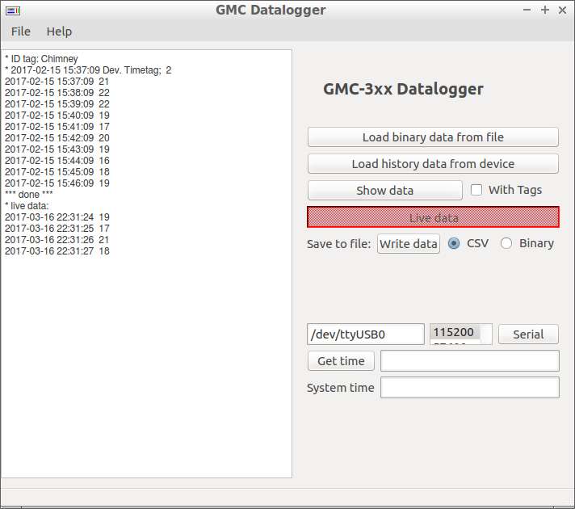

# GMC-3xx Datalogger

## Overview

The Python routines read data logged by the Geiger-Counter GMC-3xx (_GQelectronics_).

## Device

GMC-3xx (GMC-300, GMC-320) is a hand held geiger counter. Is is build around a M4011-Geigertube.

 * Length of tube about 100mm, 
 * Background counts around 20 count per minute. 
 * Size of memory: 64k. 

There are several options how data may be saved: Counts per Second ever second, counts per minute (CPM) every minute or every hour, setting of a threshold, id tags in order to mark measurements.

## Software Options

* Reading logged memory.
* Converting bytes back to text/time strings and counter values.
* Reading any binary file. If no valid date/time string is found the data is probably invalid.
* Saving text data as time vs count with or without text tags, saving binary data.
* Reading live data, ie every second a value for CPM.

## Software structure

The program is  written in Python 2.7 and pyqt4.
The routines take advantage of the ICD document by gqmc and I/O routines by Ullix (see below). The GUI source file .ui was created by the software qt-Designer and converted by ptuic4 into an appropriate Python GUI file.

## Installation

Save files below in a directory and start:

    $ python gwcmain.py
    
Files:
 * gwcmain.py    # main python program
 * gwcp3.py      # GUI definition file
 * gmcparse6.py  # basic I/O routines
 * gmcicon32.png # program icon

The program was developed under Linux. Other operating systems may work as well, perhaps the serial interface name has to be adapted (may be valid for other Linux system as well).

## License

GNU General Public License version 3.0 (GPLv3) (https://www.gnu.org/licenses/gpl-3.0.de.html)

## References:
 * [gqmc](https://sourceforge.net/projects/gqgmc/files/gqgmc/): C-program, ICD and other documentations
 * [ullix](https://sourceforge.net/projects/geigerlog/) Basic I/O Python routines
 * [GQelectronics GMC Manual](https://www.gqelectronicsllc.com/comersus/store/download.asp)
 * [GQelectronics GMC Forum](https://www.gqelectronicsllc.com/forum/forum.asp?FORUM_ID=14)

